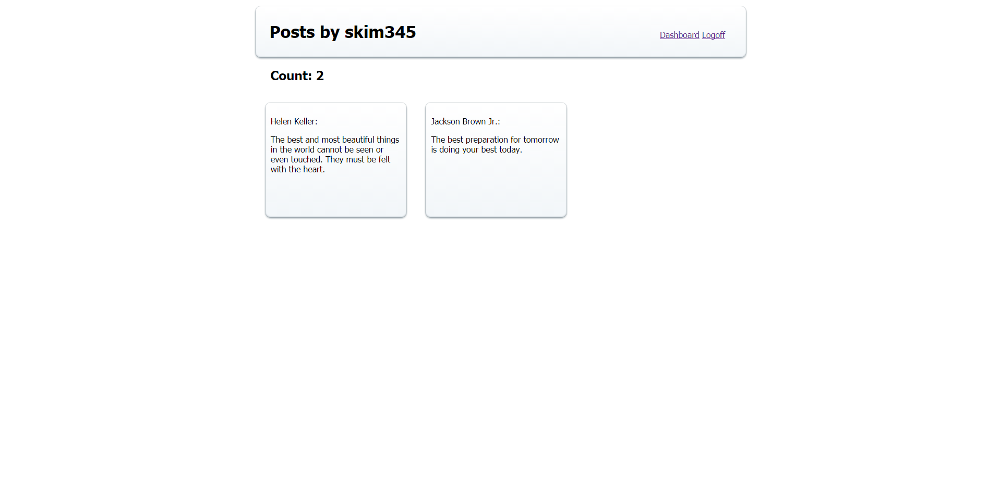

#Quotes
### A site used to save quotes a user would like to share on the website. A user can post quotes and also favorite a quote posted by the user or another user.
## Features
* Login and Registration with validations
* Creation of quotes
* Able to "favorite" quotes posted by user or other users
* Individual favorite quotes per user
* Removal of quotes from favorites
* Individual pages for user info that include their favorite quotes and how many quotes they have posted

## Technologies utilized
* PHP
* MySQL
* CodeIgniter

